# Minimalist Music Aggregator
> An Artificially Intelligent Minimalist Music Aggregator created in 2021 as a project for my System Design and Practical Project course in the British University in Dubai.

> Python and deep learning algorithoms were used to recommend music.

> Concepts from natural language processing, deep learning, and neural networks were used in this project.

> A GUI is used to display the input and the output of the program.

> The GUI is designed to look like a minimalistic music player.

## Graphic User Interface Design

> The design of any application is a fundamental and essential part of the user experience. It can make or break the user’s immersion into the application depending on whether the design serves its purpose effectively and efficiently. The design of any computer softer ware should allow accessibility and ease of use to the user no matter who the user might be. There are many ways to achieve an inclusive design that is still functional and one of them is through the use of minimalism. Minimalism is an art style that utilizes simplifies to achieve its purpose. For this application, the team has used elements of minimalism and symmetry to achieve its desired look. The reason for using such art style is because minimalism is a universal art style that most individuals can comprehend and understand without sacrificing functionality. Provided below are screen captures of what the application looks like.

### Opening form (playlist creator):

>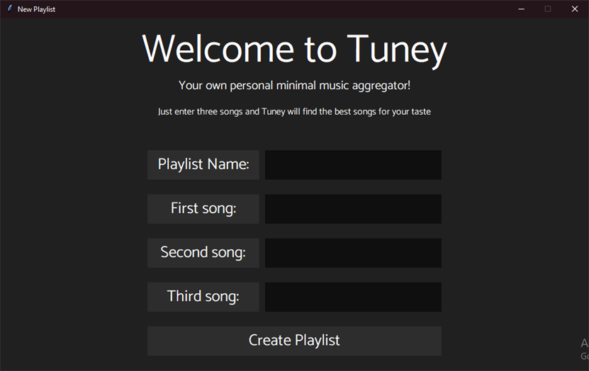

### Loading screen:

>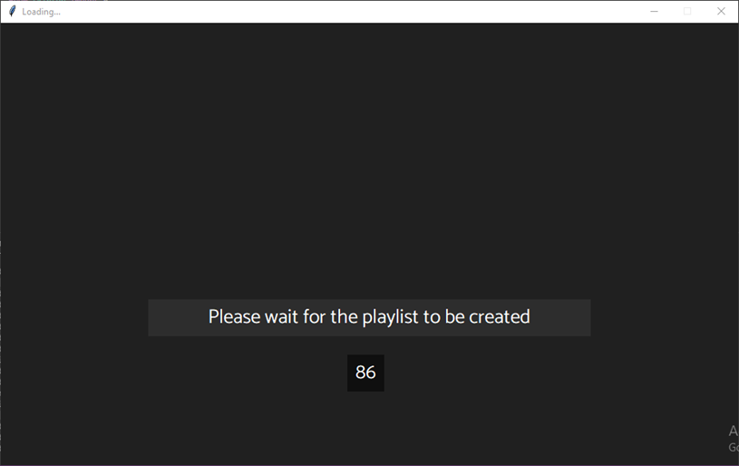

### Loading screen before completion:

>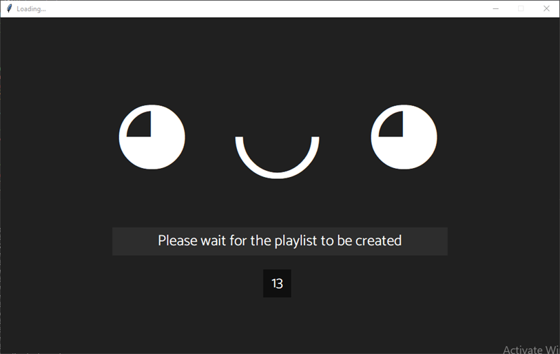

### Playlist Player:

>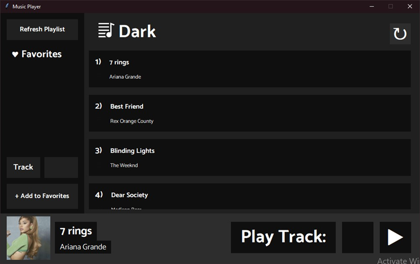

### Design Perspective:

> For the design of the graphical user interface, the team decided to go for a minimalistic yet powerful design for the application. After reviewing the most popular graphical user interfaces for music players, the team discovered that using a monochromic color pallet and focusing on symmetry is the most effective way to portray the minimalistic yet intuitive design that the team was going for. Many music streaming services use this style since it is extremely inclusive and user-friendly. The color palette is made to be monochromic so that individuals with color blindness would easily be able to navigate through the program. The contrast and size between the different elements of the graphical user interface makes it easier for individuals with farsightedness to use the application to the best of their abilities. These design choices are essential to creating a functional application since, without making the design of the program inclusive and user-friendly to all users, the application would not be usable.

### Style and Pattern:

> Since the design of the application is supposed to be minimal yet immersive, a monochromic color palette and symmetry were used. Symmetry is used in the placement of the divisions of each section in the graphical user interface. Each section has its own function with elements that help it achieve that function. Each section has a defining background so that it can be identified. All of the divisions are sized in a way that makes coherent visual sense. Most of the elements in the graphical user interface have hard edges but without any defining borders for example rectangles with hard and defined edges but without a visible bold outer line. The color of each element is used to distinguish it from its surrounding elements and the background of the division that houses it. The colors used in the graphical user interface are white, black, and different shades of grey. The color white has been chosen to be the main foreground color of the graphical user interface which is the color used to display text, symbols, and icons. The color black has been used as a highlighting agent for the displayed text. It is mainly used to highlight the tracks in the playlist and to highlight the selected track. The color black is also used as the background color for the side bar division and some entry boxes and buttons. Lastly, the shades of grey used in the project are the shades “#202020” and “#2d2d2d” in which the first shade of grey is darker than the second. The first shade of grey is used as the main background color and the second shade of grey is used as the background color for the division that displays the selected song. Both shades of grey were also used as the color for multiple different buttons and entry boxes. 

### Process:

> The graphical user interface is divided into three windows which are the playlist creator, the loading screen, and the playlist player. The playlist creator is used to obtain the playlist title that would be displayed in the playlist player window and the three songs from the user that would then be used by the recommendation system to create a playlist based on the three songs. The loading screen is used as a separator between the playlist creator window and the playlist player window. The loading screen window uses a timer to give the program some time to analyze the user’s input and download the songs needed. Through testing, the team found out that ninety seconds is the mean number of seconds needed for the program to obtain recommendations and download the songs recommended. Because of this, the loading screen window has been hardwired to wait for ninety seconds before proceeding. Although ninety seconds were given for the program to analyze the user input and download the songs, the process can take more or less time depending on the internet connection which is why the team implemented a refresh button that would refresh the playlist player window so it can load any song downloaded after the loading screen has ended. The playlist player window is used to display all the songs that has been downloaded by the program and allows the user to choose songs from the playlist and play the selected song. The playlist player window also allows the user to add their favorite tracks into a list. When executed, the program starts with the playlist creator window where the user has to enter all the information required before proceeding. If the user attempts to proceed without filling out the information needed, an error message will be displayed. After all the required information is entered, the program proceeds to the loading screen which displays a counter and a simple animation of a smiling face. After the counter runs out, the program proceeds to the last and main window which is the playlist player window. 

## Implementation

>In this stage, the team planned out the blueprints and the foundation for the many aspects of the program such as the graphical user interface and the method of achieving functionality in the most efficient way possible. As a result, the team divided the program into three parts. The first part was obtaining song recommendations, the second part was achieving the ability to play the songs that have been recommended, and the third part was the design of the graphical user interface. Since the team had been using the agile method, the development process for the three main aspects of the program has been repeated multiple times until these aspects of the program satisfied the requirements. The team mainly used Python to develop the program. The Spotify dataset and the Spotify Python library have been used to create the recommendation system while the YouTube Python library have been used to download the recommendations created by the recommendation system. The Pygame and Tkinter Python libraries have been utilized by the team to create the graphical user interface and the functionality of playing audio.

>The team started with the initialization stage where they created a recommendation system using the Spotify dataset then preceded to the analysis stage where they analyzed the effectiveness of the recommendation system and fixed any issues that had been founded during said stage. The team then proceeded onto creating the many methods that are used to get the song recommendation. Afterwards, the recommendation system was tested and debugged until it was ready for deployment.

>For the second aspect of the program, the team decided on using the YouTube python library of methods to search and download the mp3 files of all the songs that have been recommended by the recommendation system that the team created using the Spotify dataset. In the initiation stage, the team wrote the skeleton to the mp3 downloader and polished it after debugging in the analysis stage.

>For the graphical interface aspect of the program, the team first researched desirable looks, appearances, styles, and color palettes that could achieve a minimal yet innovative and user friendly design. From the research conducted, the team analyzed and concluded that most efficient way to achieve that desired minimal yet powerful look is to use a monochromic color palette with a synchronized and symmetric interface design.
 
>There are many tools to create a user graphical interface but the team decided on using the basic graphical user interface creation tool which is the Tkinter Python library because of its utility and its accessibility to every member of the team. The music player in the graphical user interface was achieved by a button from the Tkinter Python library imbedded with the mixer object from the Pygame library. The Pygame library allowed the team to implement audio playback capabilities into the graphical user interface.
 
>After everything was completed, the program ended up being made up of four classes with almost thirty methods in total with many dependencies that are too many to count. Every method had been meticulously created to achieve maximum efficiency while execution without sacrificing quality.

>There are many features that have been implemented into the application. The first notable one is the ability of the program to recognize that not all the essential information has been given by the user in the first window of the program which is the playlist creator window. If the user attempts to proceed, an error message would be displayed.

>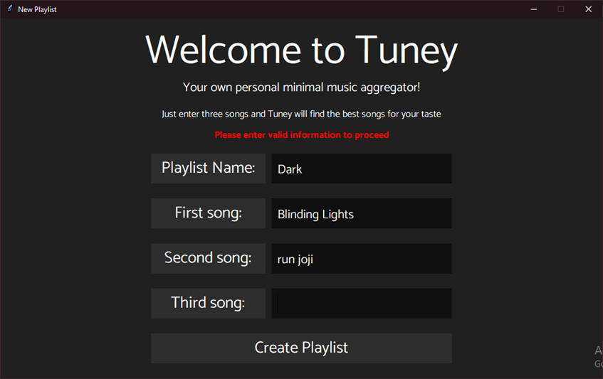

>Another major feature that has been implemented into the application is the ability of the program to reread the playlist and reload the window while adding any new songs that has been downloaded after the last time the program read the files. This feature can be accessed by pressing the refresh playlist button on the top left of the window or the refresh icon button in the top right corner of the window. In figures below, it shows an example of an empty playlist with no songs on it. After pressing the refresh button, it can be seen that 3 songs have been added which are the three songs that got downloaded after the last time the files where read. After that, the refresh button can be pressed again to reload the window once again and display the rest of the playlist.

>

>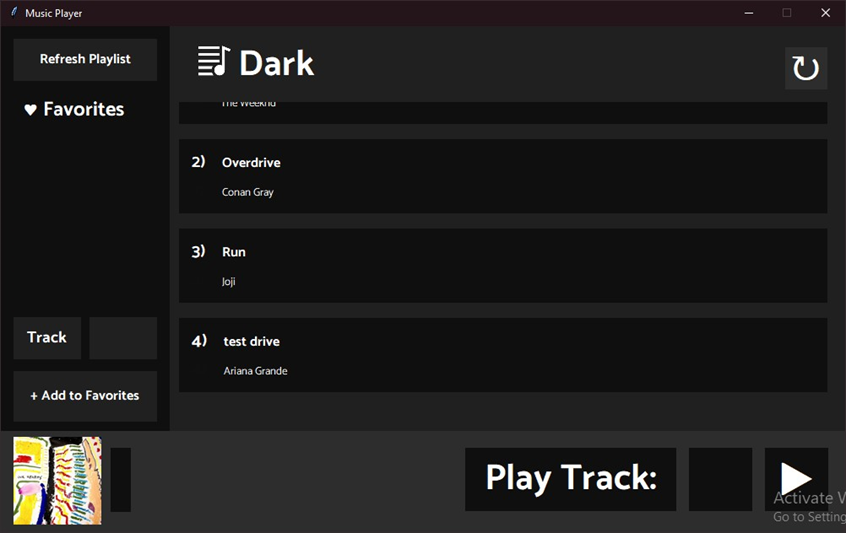

>

>One of the most important features of this application is the ability to play audio. The audio playback functionality can be accessed using the entry box and the play button found in the bottom left corner of the window. By entering the index of the desired song from the playlist and pressing the play button, the song selected will be displayed at the bottom right corner alongside the picture of the artist and the play button will change into a pause button. After pressing the play button, the audio will start playing and it can be heard through the user’s main audio output device such as headphones or speakers. This feature is presented in figure below in which the third track has been selected and is being played. As shown in the figure, the song selected lies on index 3 which is why the number 3 has been writing in the entry box found on the left side of the play button. In the same figure, it can be seen that the play button has changed the icon it houses which indicates that the audio is playing.

>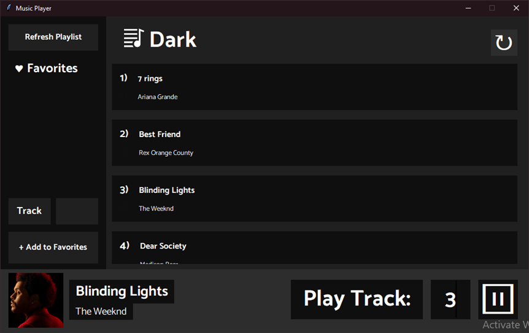

>In correspondence to the audio playback feature, another feature has been added to the entry box found on the bottom right corner. This minor feature is used to indicate that the index of the song desired by the user does not exist. That means if the user enters a number in the entry box that is outside the range of the length of the playlist, the text would turn red which indicates that there is an error. In the figure below, it can be seen that the user has entered a number outside of the range of the playlist. This results in the text turning red. In this situation, no song would be played and if there is another song being currently playing it will not affect it in any way which means it will continue playing until another song in the proper range is chosen. This feature also works on non-numeric character but instead of turning the text red, it simply removes what has been written.

>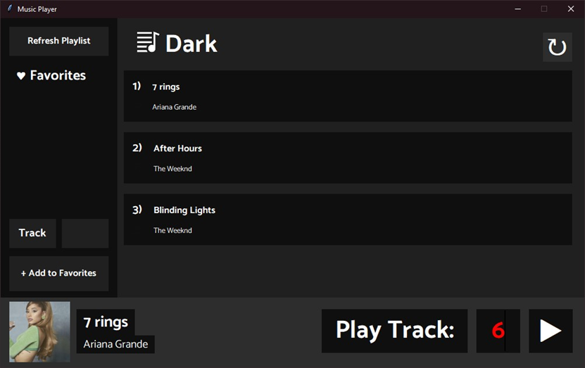

>The left side of the window houses the favorites’ side bar which can save the names of all the songs that the user has enjoyed. Saving the names of the user’s favorite songs is a feature that can be accessed by utilizing the entry box and the button found on the bottom of the side bar. By entering the track’s index then pressing the button, the program will grab the name of the song from the index and add it to the list found in the side bar under “Favorites”. An example of this feature can be seen in the figures below where the user entered the index of the third song which will then be added to the list of favorites. After pressing the button, it can be seen that the name of the song in the third index has been displayed at the end of the “Favorites” list as seen in the figures below. An error detection feature has also been implemented into the same entry box and button mentioned. This error feature prevents the user from entering neither an index that is outside of the playlist’s range nor non-numeric characters. If either of these types of these characters were to be entered, the text in the entry box will turn red which portrays an error. This can be seen in the figures below.

>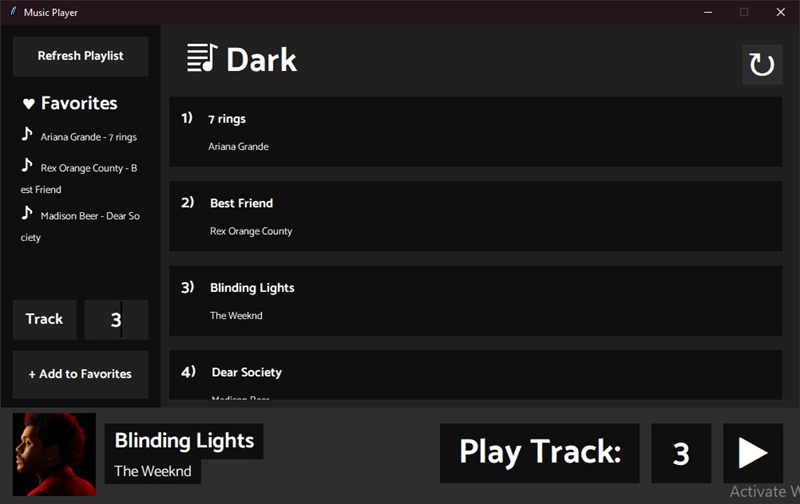

>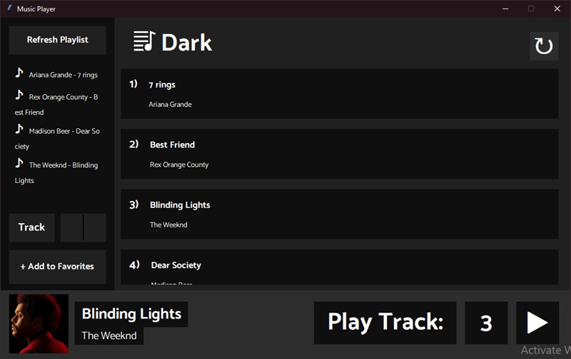

>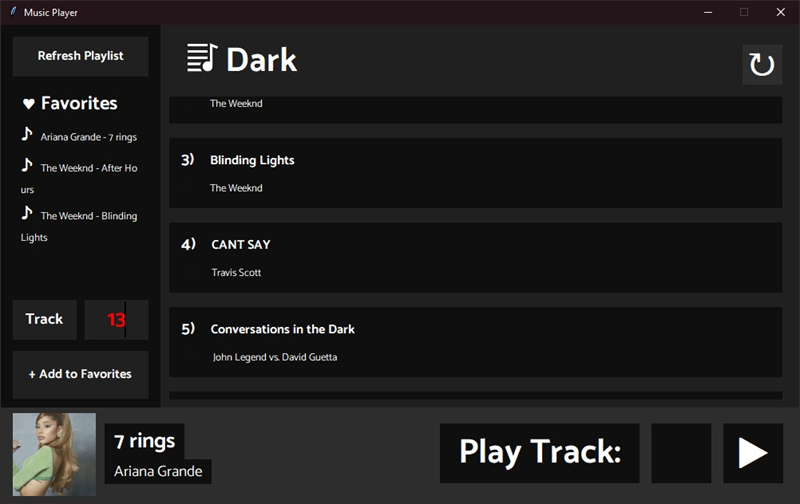

>The final notable features that have been implemented into the application and are integral to the overall workings of the program are the features found in the loading screen. These features are visual aids that help the user visualize how much time left until the loading screen can proceed onto the next window. The first feature is a timer that counts down until the time runs out and the other feature is a smiling face animation that indicates how much of the loading screen has been completed. At first, the loading screen is empty and only shows a timer that starts at 90 seconds as seen on the figures below. Subsequently, an eye from the smiling face will be displayed after 25 seconds as seen on the figures below. When the loading screen passes 50 seconds, a mouth of the smiling face would be displayed as shown on the figures below. Lastly, the figures below shows the loading screen as it reaches completion. At this point, the smiling face is fully constructed and the countdown is nearing its end.

>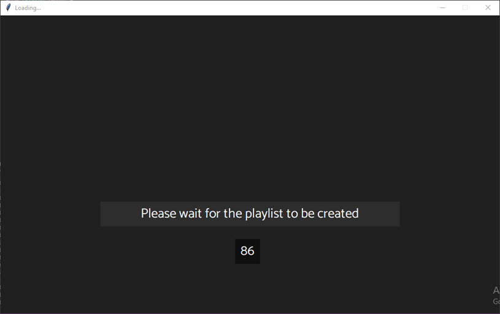

>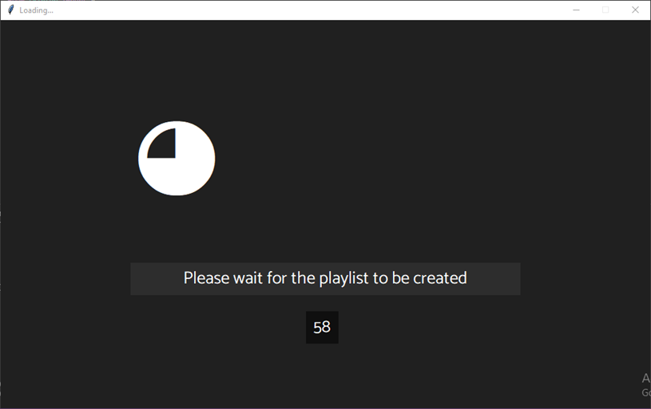

>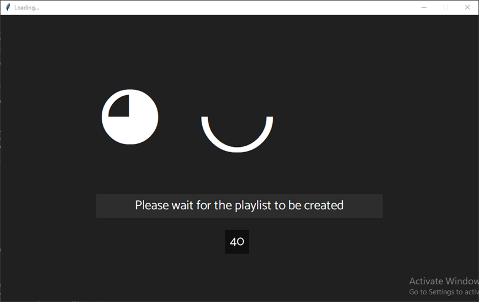

>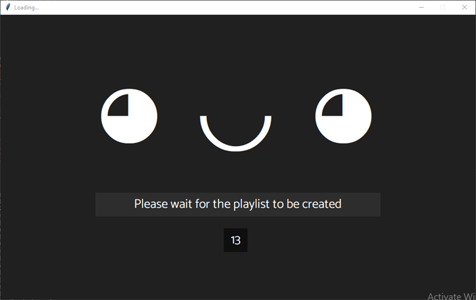
